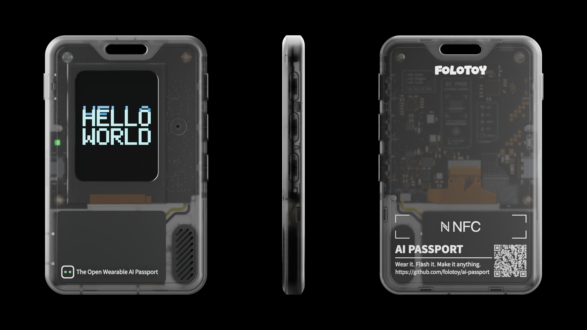

**English** · [简体中文](/docs/README.zh_CN.md)

<h1 align="center">FoloToy AI PASSPORT</h1>

<p align="center">
  <picture>
    <source media="(prefers-color-scheme: dark)" srcset="../assets/images/logo-wordmark-dark.png">
    
  </picture>
</p>

<p align="center">
  <strong>Wear it. Flash it. Make it anything.</strong><br>
  Simple and open. Anyone can build.
</p>

<p align="center">
  <a href="/docs/README.md"></a>
  <a href="/docs/README.md"></a>
  <a href="/docs/development/ai-guide.md"></a>
  <a href="/LICENSE"></a>
</p>

<p align="center">
  <a href="https://ai-passport.folotoy.cn/en/">Website</a> ·
  <a href="#start-development-with-one-requirement">Start building</a> ·
  <a href="/docs/reference/README.md">Community projects</a> ·
  <a href="#documentation-index">Documentation</a>
</p>

---

**FoloToy AI Passport** is an open wearable AI platform made for people to shape,
remix, and create. Start with a simple idea, build your own experience, and make
it anything—from a pocket companion to something no one has imagined yet.

<p align="center">
  
</p>

| Open and remixable | Easy to start | Yours to create |
| --- | --- | --- |
| Open firmware and reusable examples give you room to shape your own experience. | Start from an idea and follow clear guides to make it real, even if this is your first build. | Make a companion, a tool, a game—or anything you can imagine. |

## Find your starting point

| I want to… | Start here |
| --- | --- |
| Use the device or try an official play | [Getting started](https://ai-passport.folotoy.cn/guides/getting-started/) · [Official plays](https://ai-passport.folotoy.cn/plays/) |
| Build a custom application with AI | [Agent instructions](../AGENTS.md) · [AI development guide](development/ai-guide.md) · [Required skills](../skills/README.md) |
| Prepare my environment and build firmware | [Environment setup](development/engineering/environment-setup.md) · [Build and test](development/engineering/build-and-test.md) |
| Explore the board or contribute | [Hardware guide](hardware-design/AI_HARDWARE_DEVELOPMENT_GUIDE.md) · [Contributing](../.github/CONTRIBUTING.md) |

> [!IMPORTANT]
> `main` is a minimal, runnable **hardware-test baseline**, not a finished application.
> Derivative applications must design their own UI; the current demo test menu and
> screens must not be reused. BSP APIs and non-UI logic remain reusable.

## Start development with one requirement

1. Open the repository in your AI coding tool and have it read [`AGENTS.md`](../AGENTS.md).
2. Let it check and install the [five required skills](../skills/README.md), with any permissions your environment requires.
3. Describe what you want to build. Start from `main` on a new `feature/*` branch.

Copy this prompt and adapt it to your idea:

```text
Build an offline habit-tracking application for FoloToy AI Passport.
Use the three physical buttons and the 240×320 display, and preserve records across power loss.
Start from `main`, create a `feature/*` branch, and develop the application there.
Follow AGENTS.md and docs/hardware-design/AI_HARDWARE_DEVELOPMENT_GUIDE.md.
Inspect relevant demo branches and docs/reference/ application archives first.
Keep hardware logic in components/bsp and application logic in main.
Deliver a runnable implementation with tests; report build results,
unexecuted device checks, and on-device acceptance steps separately.
Redesign the application's UI; do not use the current demo test menu or screens.
```

Before starting, check [`docs/reference/`](reference/README.md) for an existing or
reference application and previously recorded, reusable experience, and the demo
branches. See what is already built and reusable.

<details>
<summary><strong>Write a clearer requirement</strong> — pages, controls, data, and acceptance</summary>

The more specific the requirement, the more likely the assistant is to implement it correctly in one pass. Useful details include:

- User flow: what each page displays and what short press, double press, and long press do for each button.
- State and data: whether the application needs timing, persistence across power loss, networking, recording, or communication with a computer.
- Experience goals: fonts, colors, animation, sound, response time, and error states.
- Constraints: application navigation and controls, permitted dependencies, and Flash/data usage. The baseline test menu is not an application UI option.
- Acceptance criteria: which behaviors require automated tests and which must be observed on real hardware.

When details are omitted, the assistant may choose conservative defaults that do not change the product direction, but it must list those assumptions in the delivery. Decisions involving new wiring, electrical safety, board revisions, or irreversible data formats require confirmation first.

</details>

> [!NOTE]
> A successful build is not hardware validation. Test the application on a real
> device after implementation; flashing requires your approval. Deliver a verified
> merged `full.bin` for flashing at `0x0`. No original-firmware backup is required,
> but a merged flash may reset stored data. See the [flashing policy](development/engineering/firmware-layout.md#flashing-and-stored-data).

## Demo branches are design cases, not a feature pile

Each `demo/*` branch evolves the baseline into an independent application. The branches demonstrate how specific problems were solved. New applications should normally branch from `main` and consult relevant examples instead of merging multiple demos wholesale.

The menu and `demo_*.c` pages on `main` are hardware-capability tests, not an application UI. Every derivative application must redesign and implement its own screens and interaction flow; using the current test menu, screens, or visual shell is prohibited. Renaming or recoloring them does not satisfy this requirement. BSP APIs, ordinary LVGL widgets, lifecycle patterns, and isolated logic may still be reused. See the [mandatory UI redesign rule](development/ai-guide.md#mandatory-ui-redesign-for-derivative-applications); maintenance of the baseline hardware-test demo itself is a separate task.

| Branch | Application | Patterns worth reusing |
| --- | --- | --- |
| `demo/stopwatch` | Stopwatch | Minimal timer application, separation of pure logic from LVGL, host-side logic tests |
| `demo/cat-themed-pomodoro-timer` | Cat-themed Pomodoro timer | Monotonic time, pause/resume, NVS persistence, a detailed PRD, and a state model |
| `demo/rock-paper-scissors` | Rock paper scissors | RGB565 image assets, asset-generation scripts, and Flash resource tradeoffs |
| `demo/tetris-game` | Three-button Tetris | Real-time game loop, low-latency `PRESS` input, partial refresh, a pure game model, audio, and microphone interaction |
| `demo/claude-buddy-port` | Desktop AI hardware companion | Replacing the demo menu with a complete application, encrypted BLE, protocol parsing, state reduction, task communication, and extensive host tests |

<details>
<summary><strong>Explore a demo and create your application branch</strong></summary>

Inspect an example without switching the current working tree:

```bash
git branch -r --list 'origin/demo/*'
git diff main...origin/demo/tetris-game -- main components tests
git show origin/demo/tetris-game:main/demo_tetris.c
```

Start a new application. This repository hosts several independent projects on one baseline: after starting from `main`, create a `feature/*` branch and develop the application there — do not develop directly on `main`. Each project's final branch is `feature/*` (e.g. `feature/my-passport-app`), kept separate so `main` stays a clean upstream baseline and the projects do not entangle.

```bash
git switch main
git switch -c feature/my-passport-app
```

Example branches may change the same menu, configuration, or driver in incompatible ways. Understand the differences before extracting a state model, asset pipeline, or concurrency pattern. Code appearing in an example branch is not automatically part of the current `main` BSP contract.

</details>

## Hardware capability contract

**ESP32-C3 · 8 MB Flash · no PSRAM · 240 × 320 display · three physical buttons**

The default layout contains only **NVS, PHY data, and one factory application**
spanning the remaining Flash. User firmware may use another valid 8 MB layout.
See [firmware layout](development/engineering/firmware-layout.md).

<details>
<summary><strong>Expand the capability table</strong> — interfaces, limits, and implementation details</summary>

The table below describes the application capabilities implemented by the current `main` branch. It is not a list of everything that might be possible according to the chip datasheet.

| Capability | Confirmed implementation | Application interface | Boundaries that must be respected |
| --- | --- | --- | --- |
| Display | ST7789P3, 240 × 320 portrait RGB565, SPI2 at 40 MHz; LEDC backlight | `bsp_display_*`, `bsp_lvgl_*` | The ESP32-C3 has no PSRAM; the current design uses a small single DMA buffer; the BSP exposes no LCD MISO, touch, or TE interface |
| Input | `UP`, `DOWN`, and `OK` share an ADC resistor ladder on GPIO0 | `bsp_button_init()`, `bsp_button_read_mv()` | Callbacks run in the button component task and must not block; do not create a second ADC1 unit |
| Audio | ES8311 with full-duplex PCM over I2S0, supporting playback, microphone capture, and software suspend/resume | `bsp_audio_*` | PCM reads and writes block and belong in a worker task; stop PCM I/O before codec sleep; format changes must retain the BSP close/open sequence |
| Battery | CW2017 state-of-charge and voltage readings | `bsp_battery_*` | This capability is optional at runtime; accuracy depends on the cell and battery profile and is not equivalent to a calibrated result |
| Wi-Fi | On-demand 2.4 GHz STA scan demo | `main/demo_wifi.c` | Scans only; it does not connect, store credentials, or validate antenna/RF performance |
| Bluetooth LE | On-demand non-connectable NimBLE advertising as `FoloPassport` | `main/demo_ble.c` | ESP32-C3 does not support Bluetooth Classic; radio range, coexistence, and power draw require device measurements |
| Low power | Two-second light sleep and five-second deep sleep, both with RTC timer wakeup | `main/demo_low_power.c` | Both modes force and verify ES8311 suspend; light sleep restores audio, while deep sleep first suspends CW2017, releases I2S/shared-I2C pins, sleeps and holds the LCD pins, then restarts on wake; the current demo exposes RTC timer wake only |
| Shared bus | ES8311 and CW2017 share I2C0 | `bsp_i2c_*` | Every device must reuse the bus owned by the BSP; do not create another bus on the same port for scanning or a new device |
| Logging and flashing | Native ESP32-C3 USB Serial/JTAG | ESP-IDF console | GPIO18/19 are reserved for USB; the default UART0 TX on GPIO21 conflicts with the backlight |

All pins, addresses, panel parameters, and button voltage windows are defined only in [`components/bsp/include/bsp_pins.h`](../components/bsp/include/bsp_pins.h). Application code must not duplicate these constants. See the [AI Hardware Development Guide](hardware-design/AI_HARDWARE_DEVELOPMENT_GUIDE.md) for the complete pin map, panel initialization, ADC thresholds, I2C addressing rules, audio clocks, and memory details.

Applications may also use ESP-IDF timers, FreeRTOS tasks, and internal Flash/NVS; the Pomodoro branch contains an NVS example. Wi-Fi and Bluetooth LE remain ESP-IDF application services rather than BSP APIs: their menu pages initialize each stack only while open and release it on exit. `demo/claude-buddy-port` remains a fuller BLE application architecture reference, not a substitute for measuring the current board's antenna, RF performance, power consumption, and coexistence behavior.

### Capabilities outside the current contract

The public firmware contract is limited to the interfaces listed above. Do not infer additional board interfaces from the ESP32-C3 feature list. New hardware interfaces require an explicit BSP definition and on-device acceptance criteria.

</details>

## Project structure

Board support lives in `components/bsp`; application pages, state, and tasks live
in `main`. Keep that boundary when building your own firmware.

<details>
<summary><strong>Browse the repository map</strong></summary>

```text
components/bsp/include/  Public BSP APIs and bsp_pins.h hardware facts
components/bsp/src/      Display, button, audio, battery, and shared-I2C implementations
main/                    Minimal menu, LVGL UI, and independent hardware demo pages
tests/                   Lightweight logic tests that can run without hardware
tools/                   Shared local/CI validation and firmware verification scripts
docs/                    Project docs, changelog, engineering/contribution rules, and design references
.github/                 GitHub community files, PR template, issue forms, and CI workflows
sdkconfig.defaults       ESP32-C3, USB console, Flash, and LVGL defaults
partitions.csv           Minimal default: NVS, PHY data, and one factory application
dependencies.lock        Reproducible ESP-IDF Managed Component resolution
AGENTS.md                Mandatory AI-agent entry point (paired with AGENTS.zh_CN.md)
CLAUDE.md                Claude Code pointer to AGENTS.md (paired Chinese version)
LICENSE                  Repository license
```

</details>

## Documentation index

Engineering and contribution guides define the rules; examples and archives
provide reference material. Choose the entry that matches your task.

| Resource | What you will find |
| --- | --- |
| [Development](development/README.md) | AI workflow, engineering conventions, CI, and release guidance |
| [AI skills](../skills/README.md) | Development, environment setup, builds, device testing, and debugging |
| [Hardware](hardware-design/README.md) | Board facts, interface boundaries, acceptance checklists, and troubleshooting |
| [Chinese fonts](development/engineering/lvgl-chinese-fonts.md) | Glyph coverage, widget font selection, and blank-text troubleshooting |
| [Wi-Fi provisioning](development/engineering/wifi-provisioning.md) | Bluetooth provisioning reference and companion mini program |
| [Community projects and experience](reference/README.md) | Playbooks and reusable knowledge under `docs/reference/<username>/` |
| [Contributing](contribution/README.md) | Documentation, commits, and pull-request conventions |
| [Brand assets](brand/README.md) | Product visual references and [brand language](brand/brand-and-product.md) |
| [Fork guide](fork-guide.md) · [Changelog](CHANGELOG.md) | Downstream workflows and release history |

---

[Contribute](../.github/CONTRIBUTING.md) · [Get help](../.github/SUPPORT.md) · [Code of conduct](../.github/CODE_OF_CONDUCT.md) · [Security](../.github/SECURITY.md) · [MIT License](../LICENSE)

AI agents: start with [`AGENTS.md`](../AGENTS.md) and follow its task-specific routing.
